## 1. 系统架构演变概述

### 1.1. 集中式架构

#### 1.1.1. 特点

+ 只有一个应该
+ 所有功能部署在一起
+ 部署节点和成本少
+ 适用于流量很小的时候

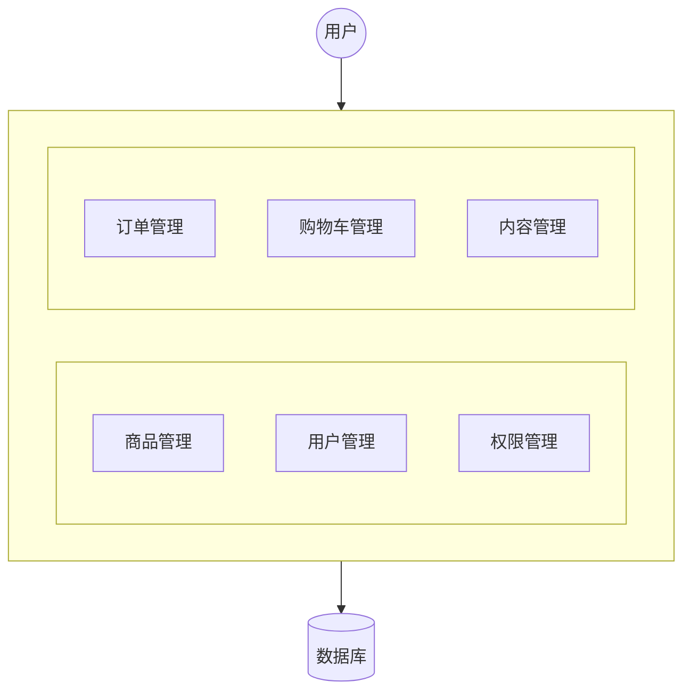

#### 1.1.2. 优点

+ 快速开发
+ 维护成本低
+ 并发要求低

#### 1.1.3. 缺点

+ 耦合高，后期维护困难
+ 无法针对不同模块优化
+ 无法水平扩展
+ 单点容错率仰慕，并发能力差

### 1.2. 垂直拆分

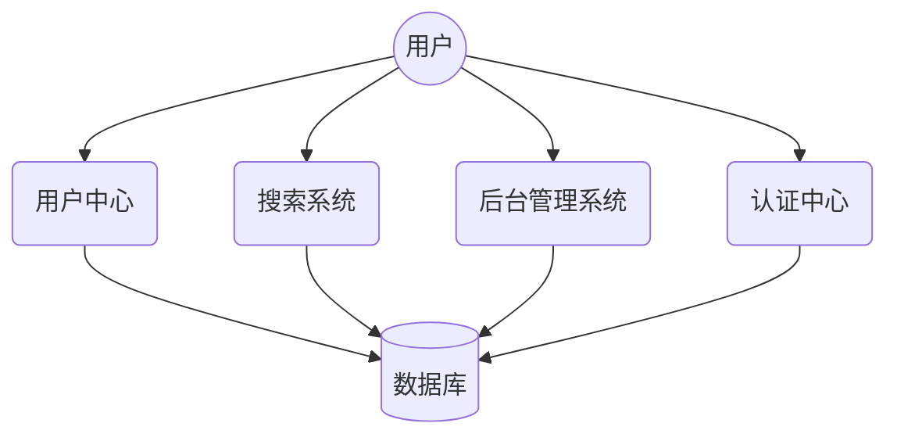

#### 1.2.1. 优点

+ 实现了流量分担，解决并发问题
+ 针对不同模块优化
+ 方便水平扩展，负载均衡，容错率高

#### 1.2.2. 缺点

+ 系统间相互独立，重复开发，开发效率不高
+ 垂直应用越来越多后，应用间的交互变多

### 1.3 分布式服务

当垂直应用越来越多，应用间交互不可避免，将部分共用的应用独立出来形成独立的公共服务，形成分布式服务。

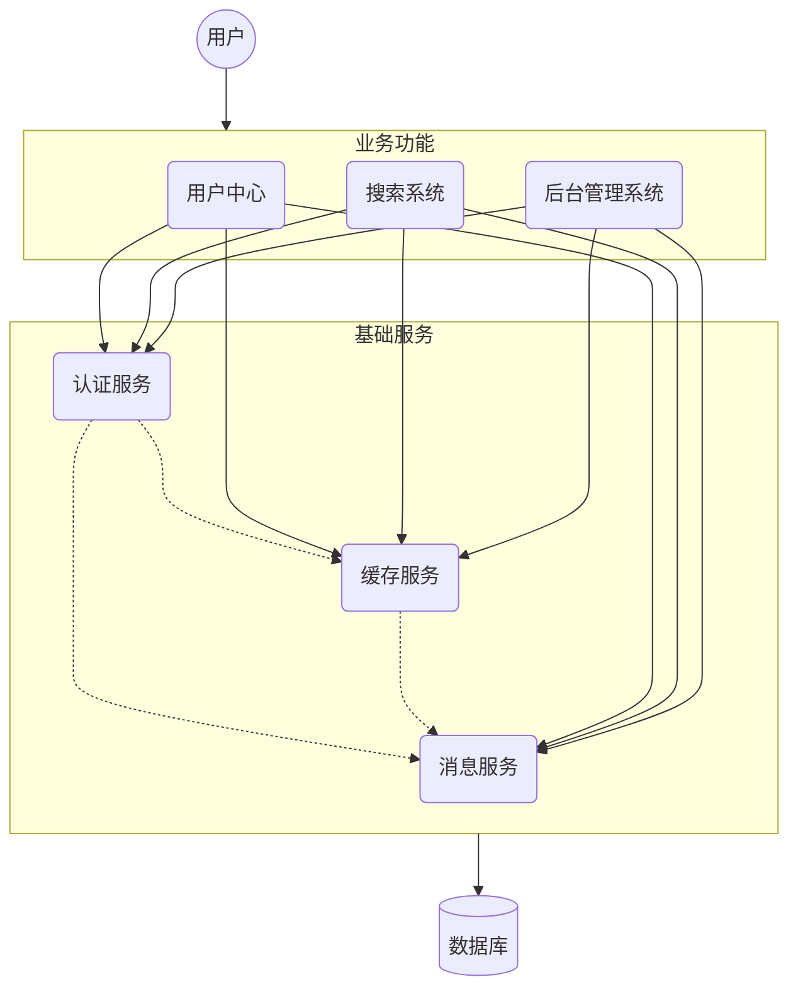

#### 1.3.1. 优点

+ 抽取基础服务，系统间相互调用，提高代码利用和开发效率

#### 1.3.2. 缺点

+ 系统间耦合度高，关系错综复杂，维护困难

### 1.4. 面向服务架构（SOA）

```mermaid
graph
a[应用A]
b[应用B]
c[应用C]
d[应用D]
esb[ESB企业服务总线]
a & b --- esb
esb --- c & d
style a fill:#123456
style b fill:#123456
style c fill:#123456
style d fill:#123456
style esb fill:#654321
```

> ESB：企业服务总线，用于连接各服务节点的一根管道，进行消息转化解释和路由工作，实现不同服务的互联互通

#### 1.4.1. SOA缺点

+ 提供应商提供的ESB产品有偏差
+ 自身实现复杂
+ 应用服务粒度较大
+ 运维、测试部署困难
+ 所有服务基于一个通路通信，降低了通信速度

### 1.5. 微服务架构

#### 1.5.1. 特点

+ 粒度小：使用一套小服务来开发单个应用
+ 职责单一：每个服务基于单一业务能力
+ 面向服务：各服务都对外暴露REST风格服务接口
+ 进程独立，开发语言独立，数据存储技术独立
+ 轻量级通信机制
+ 最低限度的集中式管理
+ 自动化部署

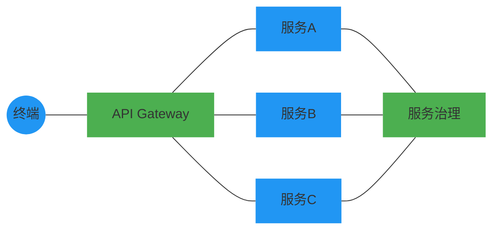

> API Gateway 网关：作为系统唯一入口的服务器：
>
> + 为客户提供一定定制的API
> + 处理所有非业务功能：身份验证、监控、负责均衡、缓存、请求分片、静态响应
> + 提供RESTfull/HTTP(s)的访问方式

微服务架构基于SOA思想，是移除了ESB的SOA：

| 功能     | SOA                  | 微服务                         |
| -------- | -------------------- | ------------------------------ |
| 组件大小 | 大块业务逻辑         | 单独任务或小块业务逻辑         |
| 耦合     | 松耦合               | 总松耦合                       |
| 管理     | 中央管理             | 分散管理                       |
| 目标     | 确保应用能够交互操作 | 易维护、易扩展、更轻量级的交互 |

## 2. 服务调用方式

常见的远程调用方式有：

+ RPC：Remote Produce Call，基于Socket，会话层，自定义数据格式，速度快、效率高。web service、dubbo
+ Http：网络传输协议，基于TCP，应用层，规定了数据传输格式，消息封闭臃肿，对服务和调用方无技术限定，自由灵活。Rest

## 3. Spring RestTemplate

进行http服务调用可以通过三类客户端工具类包：```httpClient```,```okHttp```,```JDK原生URLConnection``` ，```Spring```提供了```RestTemplate```对它们进行了封装，可以在```Spring```项目中用来进行服务调用

```java
package com.jeff.test;

import ...;

@RunWith(SpringRunner.class)
@SpringBootTest
public class RestTemplateTest {
  
  @Autowired
  private RestTemplate restTemplate;
  
  @Test
  public void test() {
    String url = "http://localhost/user/9";
    
    // restTemplate：对json格式字符串反序列化
    User user restTemplate。getForObject(url, User.class);
    System.out.println(user)
  }
}
  
```

## 4. Spring Cloud 概述

> Why:
>
> + 生态：Spring家族成员
> + 技术：强力团队支撑
> + 基础：与Spring各框架无缝融合
> + 宜用：完全支持Spring Boot开发，少量配置完成微服务框架的搭建

### 4.1. 简介

Spring Cloud官网地址：[Spring Coud](http://projects.spring.io/spring-cloud)

和Spring一样，Spring Cloud将非常流行的技术融合到一起实现了如配置管理、服务发现，智能跌幅、负载均衡、熔断器、控制总线、集群状态等功能

为协调分布式环境中各系统，并提供模板性配置，涉及的组件有：

+ Eureka：注册中心
+ Zuul、Gateway：服务网关
+ Ribbon：负载均衡
+ Feign：服务调用
+ Hystrix或Resilience4j：熔断器

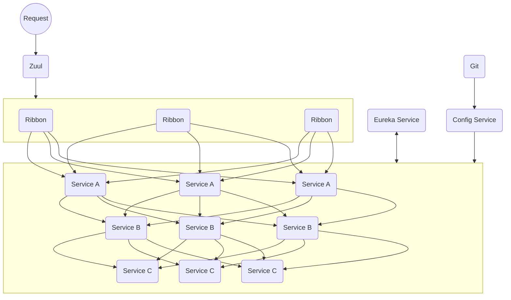

### 4.2. 版本

作为一个组件的集合，当前最新版本为```2023.0.2```

## 5. 创建微服务工程

+ 添加项目 命名micro-console
+ 添加一个module 命名user-service
+ 添加一个module 命名consumer-service

### 5.1. micro-console 

```xml
<!--  -->
<modules>
  <!-- 此处需要列出本工程中所有的子模块/工程 -->
  <module>user-service</module>
  <module>consumer-demo</module>
  <!-- ... ... -->
</modules>
<properties>
  <!-- 此节定义了父工程及子模块/工程中可以使用的通用属性 -->
  <maven.compiler.source>17</maven.compiler.source>
  <maven.compiler.target>17</maven.compiler.target>
  <project.build.sourceEncoding>UTF-8</project.build.sourceEncoding>

  <spring-cloud.version>2023.0.2</spring-cloud.version>
  <mybatis-plus-boot.version>3.5.5</mybatis-plus-boot.version>
  <mybatis-plus-generator.version>3.5.2</mybatis-plus-generator.version>
  <mysql.version>9.0.0</mysql.version>
  <spring-cloud-starter-config.version>4.1.3</spring-cloud-starter-config.version>
</properties>
<!-- 
	dependencyManagement 中的依赖并不实际引入，只作集中管理，以供子模块/工程使用
	各子模块在引入时，可以忽略版本号，以继承此处指定的版本
 -->
<dependencyManagement>
  <dependency>
      <groupId>org.springframework.cloud</groupId>
      <artifactId>spring-cloud-dependencies</artifactId>
      <version>${spring-cloud.version}</version>
      <type>pom</type>
      <!-- 通过 scope 的 import 可以继承 Spring-cloud-dendencies 工程中的依赖 -->
      <scope>import</scope>
  </dependency>
</dependencyManagement>

<dependencies>
  <!-- 不包含在dependencyManagement里的dependencies是当前父工程实际引入的依赖 -->
  <dependency>
    <groupId>org.projectlombok</groupId>
    <artifactId>lombok</artifactId>
  </dependency>
</dependencies>
```

### 5.2 user-service子模块/工程

访问mysql数据库，并公开users/{id}接口查询指定id的用户

+ pom.xml

```xml
<!-- 指定当前子工程属于哪个父工程 -->
<parent>
  <groupId>org.jeffchi</groupId>
  <artifactId>macro-server-framework</artifactId>
  <version>1.0-SNAPSHOT</version>
</parent>
<dependencies>
  <!-- 此处引入的依赖，如果是父工程中集中管理的依赖，不需要指定版本号-->
  <dependency>
    <groupId>org.springframework.boot</groupId>
    <artifactId>spring-boot-starter-web</artifactId>
  </dependency>
  <!-- ... ... -->
</dependencies>
```

+ 实体类

```java
@Getter
@Setter
@TableName("mc_user")
public class User implements Serializable {

  @TableId(type = IdType.ASSIGN_ID)
  private Long id;

  @TableField("user_name")
  private String userName;

  private String password;
  private String email;
}

```

+ mapper

```java
import com.baomidou.mybatisplus.core.mapper.BaseMapper;
import org.jeffchi.user.dto.User;
/**
 * Mapper 继承该接口后，无需编写 mapper.xml 文件，即可获得CRUD功能
 * 这个 Mapper 支持 id 泛型
 */
public interface UserMapper extends BaseMapper<User> {}
```

+ service

```java
import com.baomidou.mybatisplus.extension.service.IService;
import org.jeffchi.user.dto.User;

public interface IUserService extends IService<User> {}
```

+ serviceimpl

```java

import com.baomidou.mybatisplus.extension.service.impl.ServiceImpl;
import lombok.RequiredArgsConstructor;
import lombok.extern.slf4j.Slf4j;
import org.jeffchi.user.dto.User;
import org.jeffchi.user.mappers.UserMapper;
import org.jeffchi.user.services.IUserService;
import org.springframework.stereotype.Service;

/** The type User service. */
@Slf4j
@Service
@RequiredArgsConstructor
public class UserService extends ServiceImpl<UserMapper, User> implements IUserService {}

```

+ 配置

```yaml
server:
  port: 8081

spring:
  datasource:
    driver-class-name: com.mysql.cj.jdbc.Driver
    url: jdbc:mysql://localhost:3306/macro-cloud
    username: root
    password: ******

mybatis:
  mapper-locations: classpath:mappers/*Mapper.xml
  type-alias-package: org.jeffchi.user.dto
```

+ 控制器

```java

@Slf4j
@RestController
@RequestMapping("/users")
@RequiredArgsConstructor
public class UserController {

  private final IUserService userService;

  @GetMapping("/{id}")
  public User getUserById(@PathVariable Long id) {
    User user = userService.getById(id);
    log.info("find user for: {}", id);
    if (user != null) {
      log.info(user.getUserName());
    } else {
      log.warn("user not found");
    }
    return user;
  }
}

```

+ 启动器

```java

@MapperScan("org.jeffchi.user.mappers")
@SpringBootApplication
public class UserApplication {
  public static void main(String[] args) {
    SpringApplication.run(UserApplication.class, args);
  }
}
```

### 5.3. 搭建消费工程Consumer-Demo工程

使用restTemplate，通过接口users/{id}，跨模块/工程，调用 user-service服务根据id查询用户

+ pom.xml

```xml
<!-- 指定当前子工程属于哪个父工程 -->
<parent>
  <groupId>org.jeffchi</groupId>
  <artifactId>macro-server-framework</artifactId>
  <version>1.0-SNAPSHOT</version>
</parent>
<dependencies>
  <!-- 此处引入的依赖，如果是父工程中集中管理的依赖，不需要指定版本号-->
  <dependency>
    <groupId>org.springframework.boot</groupId>
    <artifactId>spring-boot-starter-web</artifactId>
  </dependency>
  <!-- ... ... -->
</dependencies>
```

+ 实体类

```java
// consumer-demo模块/工程不需要访问数据库，不需要相关的注解
@Data
public class User {
  private Long id;
  private String userName;
  private String password;
  private String email;
}

```

+ mapper - 不需要

+ service - 不需要

+ serviceimpl - 不需要

+ 配置

```yaml
server:
  port: 8080
```

+ 控制器

```java

@Slf4j
@RestController
@RequestMapping("/consumer")
public class ConsumerController {

  @Autowired private RestTemplate restTemplate;

  @GetMapping("/{id}")
  public User getUser(@PathVariable Long id) {
    String url = "http://localhost:8081/users/" + id;
    log.info("Requesting user at {}, with id: {}", url, id);
    User user = restTemplate.getForObject(url, User.class);
    return user;
  }
}
```

+ 启动器

```java
@SpringBootApplication
public class ConsumerApplication {
  public static void main(String[] args) {
    SpringApplication.run(ConsumerApplication.class, args);
  }

  // 在启动器中，
  @Bean
  public RestTemplate restTemplate() {
    return new RestTemplate();
  }
}

```

+ 已知问题
  * url存在硬编码问题，不方便后期维护
  * 需要存储user-service地址，如有变更，没有通知，地址可能失效
  * user-service只有一台服务器，不具备高可用性
  * user-service形成集群，consumer需要自行实现负载均衡
+ 分布式服务面临的问题
  + 服务管理
    + 自动注册
    + 状态管理
    + 动态路由
  + 负载均衡
  + 容灾问题

## 6. Eureka注册中心

### 6.1 Devops

服务消费者需要记录提供者的地址，并被动更新，服务规模激增后，造成开发、测试、发布上线困难。

DevOps思想——系统可以通过一组过程、方法，提高应用发布和运维的效率，降低管理成本

### 6.2 Eureka

实现服务的自动注册、发现、状态监控。     

+ 负责管理、记录服务提供者信息。
+ 根据调用者的需求，返回符合要求的服务。

+ 服务提供者通过心跳机制上报服务状态

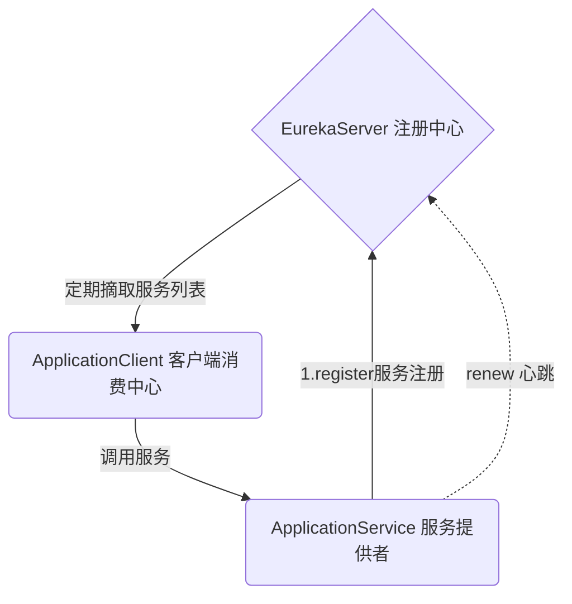

### 6.3. 搭建Eureka-server工程

Eureka是服务注册中心，只做服务注册，自身并不提供也不消费服务。可以使用SpringBoot方式搭建Web工程使用Eureka

+ 创建工程eureka-server
+ 添加启动器依赖

```xml
<dependencies>
	<dependency>
    <groupId>org.springframework.cloud</groupId>
    <artifactId>spring-cloud-starter-netflix-eureka-server</artifactId>
	</dependency>
</dependencies>
```


+ 编写（添加了Eureka服务注解）启动引导类和配置文件

  + 启动类

  ```java
  @EnableEurekaServer
  @SpringBootApplication
  public class EurekaServerApplication {
    public static void main(String[] args) {
      SpringApplication.run(EurekaServerApplication.class, args);
    }
  }
  ```

  

  + 配置文件

  ```yaml
  server:
    port: 10086
  
  spring:
    application:
      name: uereka-server
  
  eureka:
    client:
      service-url:
        # eureka 服务地址，如果是集群的话；需要指定其他集群eureka地址
        defaultZone: http://localhost:10086/eureka
  
      # 是否将自己注册到eureka，不注册，如果是集群的话，则需要将自身也作为服务注册到服务中心
      register-with-eureka: false
      # 不拉取服务
      fetch-registry: false
  ```

+ 修改配置文件（端口，应用名称）
+ 启动测试

### 6.4. 服务注册与发现

将user-service服务注册到eureka并在consumer-demo中可以根据服务名称调用

#### 6.4.1. 服务注册

在服务提供工程user-service上添加Eureka客户端依赖，自动将服务注册到EurekaServer服务地址列表

+ 添加依赖 pom.xml

```diff
+ <!-- eureka-client -->
+ <dependency>
+     <groupId>org.springframework.cloud</groupId>
+    <artifactId>spring-cloud-starter-netflix-eureka-client</artifactId>
+ </dependency>
```

+ 改造启动引导类，添加开启Eureka客户端发现的注解

```diff
 
  @MapperScan("org.jeffchi.user.mappers")
  @SpringBootApplication
+ @EnableDiscoveryClient // 开启Eureka客户端发现功能
  public class UserApplication {
    public static void main(String[] args) {
      SpringApplication.run(UserApplication.class, args);
    }
  }

```

+ 修改配置文件，设置Eureka服务地址

```diff
  spring:
    # 配置本模块注册到服务中心的名称
+   application:
+     name: user-service

  mybatis:
    mapper-locations: classpath:mappers/*Mapper.xml
    type-alias-package: org.jeffchi.user.dto

+ eureka:
+   client:
+     service-url:
+       defaultZone: http://localhost:10086/eureka
```


#### 6.4.2. 服务发现

+ 添加依赖

```diff
+ <!-- eureka-client -->
+ <dependency>
+     <groupId>org.springframework.cloud</groupId>
+    <artifactId>spring-cloud-starter-netflix-eureka-client</artifactId>
+ </dependency>
```

+ 改造启动引导类，添加开启Eureka客户端发现的注解

```diff
  @SpringBootApplication
+ @EnableDiscoveryClient // 开启Eureka客户端发现功能
  public class ConsumerApplication {
    public static void main(String[] args) {
      SpringApplication.run(ConsumerApplication.class, args);
    }

    @Bean
    public RestTemplate restTemplate() {
      return new RestTemplate();
    }
  }

```

+ 修改配置文件，设置Eureka服务地址

```diff
+ spring:
+   application:
+     name: consumer-demo

+ eureka:
+   client:
+     service-url:
+       defaultZone: http://localhost:10086/eureka
```

+ 改造处理器类ConsumerController，以使用工具类DiscoveryClient根据服务名称获取对应服务地址列表的

```diff

  @Slf4j
  @RestController
  @RequestMapping("/consumer")
  public class ConsumerController {

    @Autowired private RestTemplate restTemplate;

+   @Autowired private DiscoveryClient discoveryClient;

+   @GetMapping("/{id}")
+   public User getUserFromEureka(@PathVariable Long id) {
+     List<ServiceInstance> serviceInstance = discoveryClient.getInstances("user-service");
+     ServiceInstance serviceInst = serviceInstance.get(0);

+     String url =
+         String.format("http://%s:%s/users/%s", serviceInst.getHost(), serviceInst.getPort(), id);
+     log.info("Requesting user at {}, with id: {}", url, id);
+     return restTemplate.getForObject(url, User.class);
+   }

    @GetMapping("/old/{id}")
    public User getUser(@PathVariable Long id) {
      String url = "http://localhost:8081/users/" + id;
      log.info("Requesting user at {}, with id: {}", url, id);
      return restTemplate.getForObject(url, User.class);
    }
  }

```


在服务消费工程consumer-demo上添加Eureka客户端依赖，可以使用工具类根据服务名称获取对应的服务地址列表

### 6.5. Eureka Server 高可用配置

启动两台eureka-server实例；在eureka管理界面看到两个实例。Eureka Server作为一个web应用，可以启动多个实例（配置不同端口）保证Eureka Server的高可用。

#### 6.5.1. 基础架构

Eureka核心角色

+ 注册服务中心 - Eureka服务端应用，提供服务注册和发现功能，即eureka-server子模块/工程
+ 服务提供者 - 提供服务的应用，可以是springboot应用，或其他任意技术实现的应用，只要对外提供统一REST风格服务即可，即user-service
+ 服务消费者 - 从注册中心获取服务列表，从而获取各服务的信息，即consumer-demo

#### 6.5.2. 高可用的Eureka Server

事件上，服务注册中心（Eureka Server）可以是一个集群，形成高可用的Eureka中心。多个Eureka Server之间互相注册为服务，当有服务提供者注册到Eureka Server集群节点时，该节点会把服务信息同步给集群中的每个节点，实现数据同步，无论服务消费者访问到Eureka Server集群中的任意一个节点，都可以获取到完整的服务列表信息。

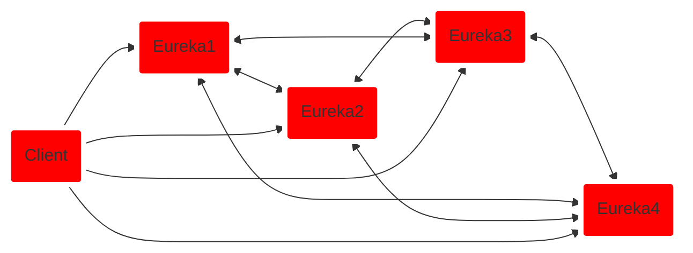

#### 6.5.3. 动手搭建两台EurekaServer集群，端口分别为10086和10087

所谓的高可用注册中心，即把EurekaServer自己也作为一个服务，注册到其他EurekaServer上，以实现多个EurekaServer互相发现对方，形成集群

+ 修改原EurekaServer配置

```diff
  server:  
- 	port: 10086
+   #如果虚拟机里，port有值，就用port，没有就用默认的10086，下同
+   port: ${port:10086}

  spring:
    application:    	
    	# 应用名称，会在eureka中作为服务的id{serviceId}
      name: eureka-server

  eureka:
    client:
      service-url:
        # eureka服务地址；如果是集群，则是其他服务器地址，后面加eureka			
-       defaultZone: http://localhost:10086/eureka
+ 			# 如果虚拟机里defaultZone有值，就用defaultZone，没有就用默认的http://127.0.0.1:10086/eureka
+       defaultZone: ${defaultZone:http://127.0.0.1:10086/eureka}

      # 是否将自己注册到eureka，不注册，如果是集群的话，则需要将自身也作为服务注册到服务中心，即配置为true，或不配置
-     register-with-eureka: false
+     # register-with-eureka: false
      # 不拉取服务
-     fetch-registry: false
+     # fetch-registry: false
		
```

+ idea启动项修改

{:.full-width}

{:.full-width}


{:.full-width}

+ 服务提供者配置

```diff
  eureka:
    client:
      service-url:
-       # defaultZone: http://localhost:10086/eureka
+       # 服务默认会注册到第一个可用的注册中心
+       defaultZone: http://localhost:10086/eureka,http://localhost:10087/eureka
```

### 6.6. Eureka客户端配置

> 配置Eureka客户端user-service的注册、续约等配置项，consumer-demo的获取服务间隔，以及失效剔除和自我保护

#### 6.6.1. Eureka 客户端工程

##### 6.6.1.1. user-service

服务提供者启动时，检测配置属性中```eureka.client.register-width-eureka```, 如果为```true```， 则用自己元数据向EurekaServer发起一个Rest请求，Eureka Server会将其保存到一个双层Map结构中：

> + 第一层Key为服务id，即```spring.application.name```属性。
> + 第二层key为服务实例id，host+serviceId+port，例如：```localhost:user-service:8081```
> + 值为服务的实例对象，即一个服务（提供方）可以启动多个不同实例，形成集群。

+ 服务地址使用ip

```yaml
eureka:
	instance:
		ip-address: 127.0.0.1 # ip
		prefer-ip-address: true # 更倾向使用ip，而非 host名
```

配置后，重启服务的提供和消费服务，在消费方使用serviceInstance.getHost()时，即可返回ip地址

> 在Eureka控制台中并不会显示ip地址，仍然显示host主机名

+ 续约

服务提供方完成注册后，会维持一个心跳，即定时向EurekaServer发Rest请求，上报状态，即服务续约。

```yaml
eureka:
	instance:
		# 服务失效时间，默认90秒
		lease-expiration-duration-in-seconds: 90
		# 续约间隔，默认30秒
		lease-renewal-interval-in-seconds: 30
```

> 默认，每30秒上报上次心跳，如果超过90秒没有发送心跳，EurekaServer即会认定该服务宕机，会定时（eureka.server.eviction-interval-timer-in-ms）从服务列表中移除

##### 6.6.1.2. consumer-demo

服务消费方启动时，会检测```eureka.client.fetch-registry```，如果为```true```，则会从EurekaServer服务的列表拉取只读备份，并缓存本地，并且每隔```eureka.client.registry-fetch-interval-seconds```重新拉取并更新

+ 获取服务地址的频率

```yaml
eureka:
	client:
		registry-fetch-interval-seconds: 30
```


##### 6.6.1.3. Eureka服务端工程

+ 服务下线 - 服务正常关闭时，会发一个服务下线的Rest请求给EurekaServer，后者将服务设置为下线状态
+ 失效剔除 - 服务不能正常工作时，注册中心的定时任务（默认60秒）会将超时（eureka.server.eviction-interval-timer-in-ms）未上报心跳的服务剔除
+ 自我保护 - 关停服务时，Eureka面板上会显示警告：

<font color="red">**EMERGENCY! EUREKA MAY BE INCORRECTLY CLAIMING INSTANCES ARE UP WHEN THEY'RE NOT. RENEWALS ARE LESSER THAN THRESHOLD AND HENCE THE INSTANCES ARE NOT BEING EXPIRED JUST TO BE SAFE.**</font>

> 上述信息表示触发了Eureka的自我保护机制，当ebbtl未按时进行心跳续约时，Eureka会统计服务实例近5分钟的心跳续约的比例是否低于85%，生产环境下可能存在心跳比例超标，关闭自我保护后，Eureka会立即剔除超时上报的服务。

## 7. 负载均衡Ribbon

### 7.1. 简介

一个算法，可以实现从地址列表中获取一个地址进行服务调用，而非总是返回第一个调用。Spring Cloud中提供了负载均衡器：```Ribbon```，并由Eureka集成。

> Ribbon是Netflix发布的负载均衡器，有助于控制HTTP和TCP客户端行为。为Ribbon配置服务提供者列表后，Ribbon可基于某种算法，自动帮助服务消费方去请求。Ribbon默认提供的算法有，轮询、随机

### 7.2. 应用

启动两个user-service，在消费工程中使用restTemplate访问服务名实现根据用户id获取用户：

```java
return restTemplate.getForObject("http://user-service/users/1", User.class);
```

> 使用Ribbon负载均衡：在执行RestTemplate发送地址请求时，使用拦截器，拦截服务名获取服务地址列表，用算法从服务地址列表中选择一个服务地址，访问该地址获取服务数据。

实现步骤：

+ 启动多个提供方实例（8081，8082）
+ 修改RestTemplate实例化方法，添加负载均衡注解

```diff
  public class ConsumerApplication {
  
  	// ...

    @Bean
+   @LoadBalanced
    public RestTemplate restTemplate() {
      return new RestTemplate();
    }
  }

```

+ 修改ConsumerController

```diff
  @Slf4j
  @RestController
  @RequestMapping("/consumer")
  public class ConsumerController {

    @Autowired private RestTemplate restTemplate;

    @Autowired private DiscoveryClient discoveryClient;

    @GetMapping("/{id}")
    public User getUserFromEureka(@PathVariable Long id) {
      // 获取eureka中注册的user-service实例
      List<ServiceInstance> serviceInstance = discoveryClient.getInstances("user-service");
      ServiceInstance serviceInst = serviceInstance.get(0);

-     String url =
-         String.format("http://%s:%s/users/%s", serviceInst.getHost(), serviceInst.getPort(), id);

+     url = String.format("http://user-service/users/%s", id);
      return restTemplate.getForObject(url, User.class);
    }
  }
```


+ 测试

## 8. 熔断器Hystrix

### 8.1. 简介

Hystrix（豪猪）在微服务中是款提供保护机制的组件，提供延迟和容错机制，以隔离访问远程服务、第三方库，防止出现级联失败。

### 8.2. 雪崩问题

微服务中，各服务间的调用关系复杂，一个请求，可能需要调用多个微服务接口才能实现，会形成非常复杂的调用链路，如果一个微服务不能正常完成工作，会造成当前请求进入等待状态，进而造成请求积压，耗尽服务器资源。

### 8.3. 线程隔离&服务降级

通过Hystrix可以解决雪崩问题：

+ 线程隔离 - 用户请求不直接访问服务，而是使用线程池中空闲的线程访问服务，加速失败判断时间
+ 服务降级 - 及时返回服务调用失败的结果，让线程不因为等待服务阻塞。

#### 8.3.1. 线程隔离

+ Hystrix为每个服务调用分配一个线程池，如果线程池已满，调用将被立即拒绝，默认不采用排队，加速失败判定时间
+ 用户请求通过该服务的线程池里空闲的线程来访问，如果线程池已满或请求超时，则会降级处理

+ 用户请求故障时，不会被阻塞或无限等待至系统崩溃，至少会等到明确的结果

#### 8.3.2. 服务降级

优先保证核心服务，而非核心服务不可用或弱可用。

服务降级会导致请求失败，但不会导致阻塞，最多会影响这个依赖服务对应线程池中的资源，对其他服务无影响。

导致服务降级的情况：

+ 线程池已满
+ 请求超时

#### 8.3.3. 实践 - 服务消费方

+ 引入依赖

```xml
<dependency>
  <groupId>org.springframework.cloud</groupId>
  <artifactId>spring-cloud-starter-netflix-hystrix</artifactId>
</dependency>
```

+ 开启熔断

```diff
  @SpringBootApplication
  @EnableDiscoveryClient // 开启Eureka客户端发现功能
+  @EnableCircuitBreaker // 开启断路器功能
+  @SpringCloudApplication // 可以代替 SpringBootApplication、EnableDiscoveryClient、EnableCircuitBreaker
  public class ConsumerApplication {
    // todo
  }
```

+ 降级逻辑

```diff

  @Slf4j
  @RestController
  @RequestMapping("/consumer")
+ // 可以在controller类上启用控制器级别的降级逻辑
+ @defaultProperties(defaultFallbackMethod = "defaultFallback")
  public class ConsumerController {

    @Autowired private RestTemplate restTemplate;

    @Autowired private DiscoveryClient discoveryClient;

    @GetMapping("/{id}")
+   // 或者开启方法级别的降级逻辑
+   @HystrixCommand(fallbackMethod = "queryByIdFallback")
+   // 如果上面开启了控制器级别的降级逻辑，则不需要指定fallbackMethod参数
+   @HystrixCommand
-   public User getUserFromEureka(@PathVariable Long id) {
+   public String getUserFromEureka(@PathVariable Long id) {
      //  ...
-     return restTemplate.getForObject(url, User.class);
+     return restTemplate.getForObject(url, String.class);
    }

    public String queryByIdFallback(Long id) {
      return "Mehod Fallback";
    }

    public String defaultFallback() {
      return "Controller Fallback";
    }
  }
```

+ 超时配置

```yaml
hystrix:
  command:
    default:
      execution:
        isolation:
          thread:
            timeoutInMilliseconds: 10000 # 超时时间

```

### 8.4. 服务熔断

#### 8.4.1 原理

类似家用电路，分布式系统应用服务熔断后，服务消费方可以自行判断反应慢或大量超时的服务，并针对性的主动熔断，防止整个系统初始拖垮。

Hystrix：弹性容错，自动重连！

+ 通过断路方式拒绝后续请求，一段时间后（默认5秒）之后允许部分请求通过
+ 调用成功后关闭断路器，否则保持打开，拒绝请求的服务

#### 8.4.2 状态模型

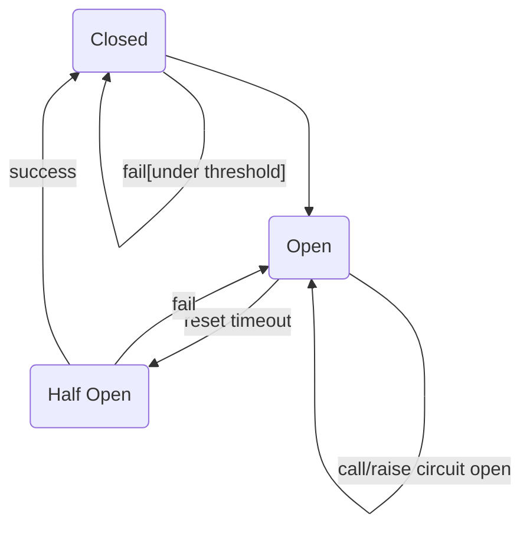

+ Closed:关闭状态，所有请求正常访问
+ Open：打开状态，所有请求都会降级。Hystrix统计请求，一定时间内失败请求百分比达阈值（默认50%），则触发熔断，完全打开。
+ Half Open：半开状态，非永久的，断路器打开后进入休眠时间（5秒），随后进入半开状态，释放部分请求通过，如果请求成功，则关闭断路器，否则保持打开，再次进入休眠...

#### 8.4.3. 实践 consumer-demo

+ controller

```diff
	@HystrixCommand
  public String getUserFromEureka(@PathVariable Long id) {

+   // 不停访问id为2，触发断路器打开，再访问id=1，由于断路器已打开，验证结果也应该报服务降级，
+   // 稍后等断路器进入半开状态后，再次访问id=1，请求正常，进而使得断路器关闭
+   if (id == 2) {
+     throw new RuntimeException("service is busy!");
+   }
    String url = String.format("http://user-service/users/%s", id);
    log.info("Requesting user at {} with ribbon", url);
    return restTemplate.getForObject(url, String.class);
  }
```

+ 配置

```diff
  hystrix:
    command:
      default:
        execution:
          isolation:
            thread:
              timeoutInMilliseconds: 10000 # 超时时间

+       circuitBreaker:
+         requestVolumeThreshold: 10 # 熔断器触发熔断最小请求次数
+         sleepWindowInMilliseconds: 10000 # 熔断打开后的休眠时长
+         errorThresholdPercentage: 50 # 熔断器错误率阈值

```

### 8.5. 版本更新与废弃⚠️

Hystrix组件及相关EnableCircuitBreaker、SpringCloudApplication注解在最新的SpringBoot3中已废弃，有新的替代方案

+ pom.xml

```diff
  <properties>
      <maven.compiler.source>17</maven.compiler.source>
      <maven.compiler.target>17</maven.compiler.target>
      <project.build.sourceEncoding>UTF-8</project.build.sourceEncoding>
+     <resilience4j.version>2.2.0</resilience4j.version>
  </properties>

  <dependencies>
-   <dependency>
-     <groupId>org.springframework.cloud</groupId>
-     <artifactId>spring-cloud-starter-netflix-hystrix</artifactId>
-   </dependency>
+   <dependency>
+     <groupId>io.github.resilience4j</groupId>
+     <artifactId>resilience4j-circuitbreaker</artifactId>
+     <version>${resilience4j.version}</version>
+   </dependency>
+   <dependency>
+     <groupId>io.github.resilience4j</groupId>
+     <artifactId>resilience4j-retry</artifactId>
+     <version>${resilience4j.version}</version>
+   </dependency>
+   <dependency>
+     <groupId>io.github.resilience4j</groupId>
+     <artifactId>resilience4j-ratelimiter</artifactId>
+     <version>${resilience4j.version}</version>
+   </dependency>
+   <dependency>
+     <groupId>io.github.resilience4j</groupId>
+     <artifactId>resilience4j-bulkhead</artifactId>
+     <version>${resilience4j.version}</version>
+   </dependency>
+   <dependency>
+       <groupId>io.github.resilience4j</groupId>
+       <artifactId>resilience4j-annotations</artifactId>
+       <version>${resilience4j.version}</version>
+   </dependency>
  </dependencies>
```

+ 启动器和配置

新的Resilience4j方案不需要对启动器作任何配置

```diff

-  hystrix:
-    command:
-      default:
-        execution:
-          isolation:
-            thread:
-              timeoutInMilliseconds: 10000 # 超时时间

-        circuitBreaker:
-          requestVolumeThreshold: 10 # 熔断器触发熔断最小请求次数
-          sleepWindowInMilliseconds: 10000 # 熔断打开后的休眠时长
-          errorThresholdPercentage: 50 # 熔断器错误率阈值

+  resilience4j:
+    circuitbreaker:
+      instances:
+        backendA:
+          register-health-indicator: true
+          sliding-window-size: 100
+          minimum-number-of-calls: 10
+          failure-rate-threshold: 50
+          wait-duration-in-open-state: 60s
+          permitted-number-of-calls-in-half-open-state: 5
```

+ 控制器或服务类

```diff

  @Slf4j
  @RestController
  @RequestMapping("/consumer")
- @DefaultProperties(defaultFallbackMethod = "queryByIdFallback")
  public class ConsumerController {

    @Autowired private RestTemplate restTemplate;

    @Autowired private DiscoveryClient discoveryClient;

    @GetMapping("/{id}")
-   @HystrixCommand(fallbackMethod = "defaultFallback")
-   @HystrixCommand
+   @CircuitBreaker(name = "backendA", fallbackMethod = "queryByIdFallback")
    public String getUserFromEureka(@PathVariable Long id) {
      // TODO

      // 不停访问id为2，触发断路器打开，再访问id=1，由于断路器已打开，验证结果也应该报服务降级，
      // 稍后等断路器进入半开状态后，再次访问id=1，请求正常，进而使得断路器关闭
      if (id == 2) {
        throw new RuntimeException("service is busy!");
      }
      String url = String.format("http://user-service/users/%s", id);
      log.info("Requesting user at {} with ribbon", url);
      return restTemplate.getForObject(url, String.class);
    }

    public String queryByIdFallback(Long id) {
      log.error("Request user failed, id: {}", id);
      return "Fallback";
    }

  }
```

> ##### 使用 Resilience4j 配合 Spring Cloud Gateway
>
> 如果你使用 Spring Cloud Gateway，可以使用 Resilience4j 的断路器作为过滤器 -- 后续介绍

## 9.  Feign

### 9.1 简介

Feign-伪装，可以隐藏Rest请求，伪装为类似SpringMVC的Controller一样，无需自行拼接url和参数

### 9.2. 应用 - Consumer-Demo

+ 导入启动器依赖

```diff
+ <dependency>
+   <groupId>org.springframework.cloud</groupId>
+   <artifactId>spring-cloud-starter-openfeign</artifactId>
+ </dependency>
```

+ 开启Feign功能

```diff
  @SpringBootApplication
  @EnableDiscoveryClient // 开启Eureka客户端发现功能
+ @EnableFeignClients // 开启Feign客户端功能
  public class ConsumerApplication {
    public static void main(String[] args) {
      SpringApplication.run(ConsumerApplication.class, args);
    }

    @Bean
    @LoadBalanced
    public RestTemplate restTemplate() {
      return new RestTemplate();
    }
  }
```

+ 编写Feign客户端接口

```java
// 客户端接口
import org.jeffchi.consumer.dto.User;
import org.springframework.cloud.openfeign.FeignClient;
import org.springframework.web.bind.annotation.GetMapping;
import org.springframework.web.bind.annotation.PathVariable;

/** 声明当前类是一个Feign客户端，指定服务名为user-service */
@FeignClient(value = "user-service")
public interface IUserClient {
  
  @GetMapping("/user/{id}")
  User getUserById(@PathVariable Long id);
}

```

+ 编写处理器ConsumerFeignController，注入Feign客户端并使用

```java
// 客户端控制器
import org.jeffchi.consumer.dto.User;
import org.jeffchi.consumer.feign.clients.IUserClient;
import org.springframework.beans.factory.annotation.Autowired;
import org.springframework.web.bind.annotation.PathVariable;
import org.springframework.web.bind.annotation.RequestMapping;
import org.springframework.web.bind.annotation.RestController;

@RestController
@RequestMapping("/cf")
public class ConsumerFeignController {
  @Autowired private IUserClient userClient;

  @RequestMapping("/{id}")
  public User getUserById(@PathVariable Long id) {
    return userClient.getUserById(id);
  }
}
```

### 9.3. Feign负载均衡及熔断

Feign内置ribbon和Hystrix的Fallback的配置项

#### 9.3.1. 负载均衡

Feign内置ribbon，默认设置了请求超时时长，及是否开启重试机制。

```yaml
ribbon:
  ConnectionTimeout: 5000 # 连接超时时间
  ReadTimeout: 5000 # 读取超时时间
  MaxAutoRetries: 0 # 当前服务实例重试次数
  MaxAutoRetriesNextServer: 1 # 重试其他服务实例次数
  NFLoadBalancerRuleClassName: com.netflix.loadbalancer.RoundRobinRule # 负载均衡策略
  OkToRetryOnAllOperations: true # 是否对所有操作都进行重试
```

> 在服务提供方相关方法中，启用Thread.sleep延时，如果配置正确，则应该接口异常报错


#### 9.3.2. 服务熔断

##### 9.3.2.1. 开启Feign熔断

Feign内置的hystrix默认关闭，需手动开启

```yaml
feign
	hystrix：
		enable: true
```

##### 9.3.2.2. 配置Fallback

+ 定义一个fallback处理类，实现```9.2.```里定义的IUserClient接口

```java
import org.jeffchi.consumer.dto.User;
import org.jeffchi.consumer.feign.clients.IUserClient;
import org.springframework.stereotype.Component;

@Component
public class UserClientFallback implements IUserClient {
  
  @Override
  public User getUserById(Long id) {
    User user = new User();
    user.setId(id);
    user.setUserName("Fallback");
    return null;
  }
}
```

+ 在IUserClient的FeignClient注解中指定fallback参数为该fallback处理类

```diff

  /** 声明当前类是一个Feign客户端，指定服务名为user-service */
- @FeignClient(value = "user-service")
+ @FeignClient(value = "user-service", fallback = UserClientFallback.class)
  public interface IUserClient {
    /**
     * Gets user by id.
     *
     * @param id the id
     * @return the user by id
     */
    @GetMapping("/users/{id}")
    User getUserById(@PathVariable Long id);
  }
```

+ 测试

> 在服务提供方相关方法中，启用Thread.sleep延时，如果配置正确，则应该返回一个名为Fallback的User，而非页面报错

##### 9.3.2.3 版本更新与废弃⚠️

配置Feign与Hystrix的替代方案Resilience4j

+ 依赖

```xml
<dependency>
    <groupId>org.springframework.cloud</groupId>
    <artifactId>spring-cloud-starter-openfeign</artifactId>
</dependency>
<dependency>
    <groupId>io.github.resilience4j</groupId>
    <artifactId>resilience4j-spring-boot3</artifactId>
</dependency>
```

+ 配置Resilience4j

```yaml
resilience4j.circuitbreaker:
  instances:
    yourClientCfg:
      registerHealthIndicator: true
      slidingWindowSize: 10
      failureRateThreshold: 50
      waitDurationInOpenState: 10000
```

+ Feign客户端

```java
@FeignClient(name = "yourClientCfg", url = "http://yourapi.com", fallback = YourClientFallback.class)
public interface IYourClient {
    @GetMapping("/your-endpoint")
    String getYourData();
}
```

+ 定义回退类

```java
import org.springframework.stereotype.Component;

@Component
public class YourClientFallback implements IYourClient {
    @Override
    public String getYourData() {
        return "Fallback response";
    }
}

```

+ 启用Feign

```java
@SpringBootApplication
@EnableFeignClients
public class YourApplication {
    public static void main(String[] args) {
        SpringApplication.run(YourApplication.class, args);
    }
}
```

+ 使用

```java
@Service
public class YourService {

    @Autowired private final IYourClient yourClient;
  
    public String fetchData() {
        return yourClient.getYourData();
    }
}

```

### 9.4. 请求压缩

Feign支持对请求和响应进行GZIP压缩，以减少通信过程上的性能损耗，还可以对请求的数据类型及触发压缩的大小下限设置：

```yaml
feign:
	compression:
		request:
			enable: true # 开启请求压缩
			mime-types: text/html,application/xml,application/json # 压缩的数据类型
			mime-request-size: 2048 # 设置触发压缩的下限
		response:
			enable: true # 开启响应压缩
```

### 9.5. 日志级别

+ 配置

```yaml
loggin.level:
	org.jeffchi: debug # NONE,BHASIC,HEADERS,FULL
```

+ 配置类

```JAVA
import feign.Logger;
import org.springframework.context.annotation.Bean;
import org.springframework.context.annotation.Configuration;

@Configuration
public class FeignConfig {
  @Bean
  Logger.Level feignLoggerLevel() {
    return Logger.Level.FULL;
  }
}
```

+ 启用

```diff

  /** 声明当前类是一个Feign客户端，指定服务名为user-service */
- @FeignClient(value = "user-service", fallback = UserClientFallback.class)
+ @FeignClient(value = "user-service", fallback = UserClientFallback.class, configuration = FeignConfig.class)
  public interface IUserClient {
    @GetMapping("/users/{id}")
    User getUserById(@PathVariable Long id);
  }

```

## 10. 网关

### 10.1. 简介

+ 官方基于Spring5、SpringBoot2、Project Reactor开发
+ 基于Filter链提供网关基本的安全、监控/埋点、限流等功能，核心功能是过滤和路由
+ 为微服务提供简单、有效且统一的API路由管理方式
+ Netflix Zuul的替代方案

### 10.2. 架构

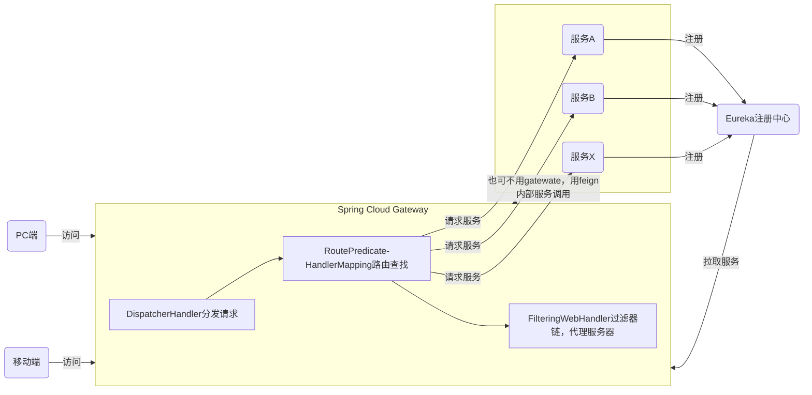

> Gateway是各服务的统一入口，不论是客户端的请求还是服务内部的调用，都可以经过网关，并由后者实现鉴权、动态路由。

### 10.3. 核心概念

+ 路由（route）由一个ID、目标URL、断言工厂和一组Filter组成
+ 断言（Predicate）Spring Cloud Gateway的断言比哦允许开发者定义匹配 Http Request中的任何信息
+ 过滤器（Filter）一个标准的Spring WebFilter。Spring Cloud Gateway有两类Filter用来修改请求和响应：
  + Gateway Filter 
  + Global Filter

### 10.4. 入门

搭建与测试网关服务工程gateway：将包含/user的请求路由到http://127.0.0.1/users/{uid}

+ 创建工程gateway
+ 添加依赖

```xml
<dependency>
  <groupId>org.springframework.cloud</groupId>
  <artifactId>spring-cloud-starter-gateway</artifactId>
</dependency>

<dependency>
  <groupId>org.springframework.cloud</groupId>
  <artifactId>spring-cloud-starter-netflix-eureka-client</artifactId>
</dependency>
```

+ 编写启动器类

```java
import org.springframework.boot.SpringApplication;
import org.springframework.boot.autoconfigure.SpringBootApplication;
import org.springframework.cloud.client.discovery.EnableDiscoveryClient;

@SpringBootApplication
@EnableDiscoveryClient
public class GatewayApplication {
  public static void main(String[] args) {
    SpringApplication.run(GatewayApplication.class, args);
  }
}
```

+ 修改配置文件，设置路由信息

```yaml
server:
  port: 10080
spring:
  application:
    name: api-gateway
  cloud:
    gateway:
      routes:
        # 路由id
        - id: user-service-route
          # 代理服务地址 - 断言命中后要转发到的真正的服务地址
          uri: http://localhost:8081
          # 断言 - 匹配映射路径
          predicates:
            - Path=/users/**

eureka:
  client:
    service-url:
      defaultZone: http://127.0.0.1:10086/eureka/
  instance:
    prefer-ip-address: true

```

+ 测试

启动user-service、eureka-server 和 gateway工程，如果正常，通过gateway url http://127.0.0.1:10080/users/1 应该被转发到 user-service 的url http://127.0.0.1:8081/users/1，并返回正常的用户信息

### 10.5. 路由

#### 10.5.1 面向服务的路由

上面路由的代理服务地址写死，在代理的服务有多个实例时，是不合理的，可以在Spring Cloud Gateway中可以通过配置动态路由，实现根据Eureka中注册的服务名称，去注册中心查找对应的实例列表，进行动态路由。

+ 修改配置

```diff
server:
  port: 10080
spring:
  application:
    name: api-gateway
  cloud:
    gateway:
      routes:
        # 路由id
        - id: user-service-route
          # 代理服务地址 - 断言命中后要转发到的真正的服务地址
-         uri: http://localhost:8081
+         uri: lb://user-service
          # 断言 - 匹配映射路径
          predicates:
            - Path=/users/**

eureka:
  client:
    service-url:
      defaultZone: http://127.0.0.1:10086/eureka/
  instance:
    prefer-ip-address: true
```


+ 测试

通过访问 http://127.0.0.1:10081/users/1 应该可以正常拿到对应的用户数据

#### 10.5.2. 路由前缀处理

对请求到网关服务的地址汪厍或去除前缀

+ 添加前缀 - 对请求地址添加前缀路径之后再人生为代理的服务地址，通过PerfixPath过滤器实现

```diff
  cloud:
    gateway:
      routes:
        # 路由id
        - id: user-service-route
          # 代理服务地址 - 断言命中后要转发到的真正的服务地址
          # uri: http://127.0.0.1:8081
          uri: lb://user-service
          # 断言 - 匹配映射路径
          predicates:
+           # 临时修改Path，实现 http://127.0.0.1:10081/1 --> http://127.0.0.1:8081/users/1  
-           # - Path=/users/**
+           - Path=/**
+         filters:
+           # 添加前缀
+           - PrefixPath=/users

```

+ 去除前缀 - 将请求地址中路径去除一些前缀路径之后再作为代理地址，通过StripPrefix过滤器实现

```diff
  cloud:
    gateway:
      routes:
        # 路由id
        - id: user-service-route
          # 代理服务地址 - 断言命中后要转发到的真正的服务地址
          # uri: http://127.0.0.1:8081
          uri: lb://user-service
          # 断言 - 匹配映射路径
          predicates:
+           # 临时修改Path，实现 http://127.0.0.1:10081/api/users/1 --> http://127.0.0.1:8081/users/1
-           # - Path=/api/users/**
+           - Path=/**
+         filters:
+           # 去除前缀，1代表一个路径，2代表两个路径，...
+           - StripPrefix=1
```

### 10.6. 过滤器

+ 过滤器类型

  + 全局过滤器

  不需要在配置文件中配置，作用在所有路由上，需实现GlobalFilter接口

  + 局部过滤器

  配置在spring.cloud.gateway.routes.filters，仅作用于当前路由，预置的或自定义的过滤器都可以配置。如果配置在spring.cloud.gateway.default-filters上，也会对所有路由生效，实现GatewayFilterFactory接口

  

#### 10.6.1. 默认过滤器

+ 常用的过滤器

  | 过滤器名称           | 说明                         |
  | -------------------- | ---------------------------- |
  | AddRequestHeader     | 对匹配的请求添加Header       |
  | AddRequestParameters | 对匹配的请求路由添加参数     |
  | AddResponseHeader    | 对从网关返回的响应添加Header |
  | PrefixPath           | 对路由地址添加前缀           |
  | StripPrefix          | 对路由地址去除前缀           |

  > Spring Cloud Gateway 过滤器官网地址：https://cloud.spring.io/spring-cloud-gateway/reference/html/#gatewayfilter-factories

  用法：

```diff
 spring.cloud.gateway:
+  # 默认过滤器，对所有路由都升效
+  default-filter:
+    # - 请求头属性名，请求头属性值，同一个过滤器，可以重复添加
+    - AddRequestHeader=X-Request-Foo, Bar
  routes:
    # 路由id
    - id: user-service-route
      # 代理服务地址 - 断言命中后要转发到的真正的服务地址
      # uri: http://127.0.0.1:8081
      uri: lb://user-service
      # 断言 - 匹配映射路径
      predicates:
        # - Path=/users/**
        - Path=/**
+      # 局部过滤器，仅针对匹配的本路由升效
+      filters:
+        # 添加前缀
+        - PrefixPath=/users

```

+ 生命周期

和拦截器类似，网关过滤器的生命周期有pre和post，分别在请求执行的前后调用，通过在foppish器的GatewayFilterChain执行filter方法前后来实现

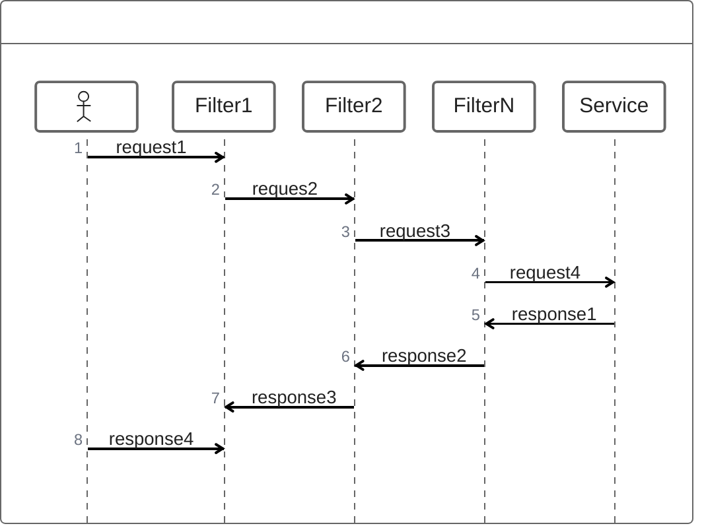

+ 使用场景
  + 请求鉴权 - filter方法前，如果没有访问权限，直接返回空
  + 异常处理 - filter方法后，记录异常并返回
  + 服务调用时长统计 - filter方法前后根据时间统计

#### 10.6.2. 自定义过滤器

##### 10.6.2.1 自定义局部过滤器

编写并配置一个局部过滤器，以通过配置文件中的参数名称获取请求参数

+ 编写过滤器

```java
@Component
public class MyParamGatewayFilterFactory
    extends AbstractGatewayFilterFactory<MyParamGatewayFilterFactory.Config> {

  static final String PARAM_NAME = "param";

  public MyParamGatewayFilterFactory() {
    super(Config.class);
  }

  @Override
  public GatewayFilter apply(Config config) {
    return (exchange, chain) -> {
      ServerHttpRequest request = exchange.getRequest();
      if (request.getQueryParams().containsKey(config.param)) {
        request
            .getQueryParams()
            .get(config.param)
            .forEach(
                value -> System.out.printf("----局部过滤器----%s = %s---------", config.param, value));
      }
      return chain.filter(exchange);
    };
  }

  public List<String> shortcutFieldOrder() {
    return List.of(PARAM_NAME);
  }

  @Setter
  @Getter
  public static class Config {
    // 配置中的参数名
    private String param;
  }
}

```

+ 配置过滤器

```yaml

spring.cloud.gateway.routes.filters:.
  # 自定义局部过滤器
  - MyParam=name
```

+ 测试

当测试获取用户信息时，http://127.0.0.1:10081/users/1时，不会有输出，如果带有查询参数?name=asdf时，将会输出“"----局部过滤器----name = asdf---------"”

##### 10.6.2.2. 自定义全局过滤器

定义一个全局过滤器，检查请求中是否携带token参数

+ 编写全局过滤器

```java
import lombok.extern.slf4j.Slf4j;
import org.springframework.cloud.gateway.filter.GatewayFilterChain;
import org.springframework.cloud.gateway.filter.GlobalFilter;
import org.springframework.core.annotation.Order;
import org.springframework.http.HttpStatus;
import org.springframework.http.server.reactive.ServerHttpResponse;
import org.springframework.http.server.reactive.ServerHttpRequest;
import org.springframework.web.server.ServerWebExchange;
import reactor.core.publisher.Mono;

import static org.apache.commons.lang.StringUtils.isEmpty;

@Slf4j
@Order(0)
public class GlobalTokenFilter implements GlobalFilter {

  @Override
  public Mono<Void> filter(ServerWebExchange exchange, GatewayFilterChain chain) {
    log.info("---GlobalTokenFilter---");
    ServerHttpRequest request = exchange.getRequest();
    String token = request.getHeaders().getFirst("token");
    if(isEmpty(token)){
      ServerHttpResponse response = exchange.getResponse();
      response.setStatusCode(HttpStatus.UNAUTHORIZED);
      
      return response.setComplete();
    }
    return chain.filter(exchange);
  }
}
```

+ 测试

全局过滤器无需任何配置，直接运行项目，

### 10.7. 其他配置

#### 10.7.1 跨域配置

```yaml
spring.cloud.globalcors.corsConfigurations:
	'[/**]':
		# allowdOrigins: * 表示允许所有的跨跨域
		allowdOrigins:
			- "http://service address"
		allowedMethods:
			- GET
			- POST
			- OPTIONS
			- PATCH
			- DELETE
			- PUT
	
```

> 因为内部各服务间的调用也可以经由网关，allowedOrigins 也可以指定内部的服务地址。

#### 10.7.2. 高可用

即启动多个Gateway服务，自动注册到Eureka，形成集群

+ 服务内部访问，自动负载均衡
+ 外部访问，无法通过Eureka进行负载均衡，可以使用其他服务网关，如Nginx对Gateway进行代理

#### 10.7.3. 与Feign区别

+ Gateway是整个应用的流量入口，接收所有的请求，并转发至不同的微服务模块，作业类同Nginx，多为鉴权，流量控制
+ Feign将当前微服务的部分服务接口暴露，并用于各微服务之间的调用

#### 10.7.4 负载均衡和熔断

Gateway中默认集成了Ribbon、Hystrix，使用默认策略，可以手动修改：

```yaml
hystrix:
	command:
		default:
			execution:
				isolation:
					thread:
						timeoutInMilliseconds: 6000
						
						
ribbon:
	ConnectTimeout: 1000
	ReadTimeout: 2000
	MaxAutoRetries: 0
	MaxAutoRetriesNextServer: 0
```

#### 10.7.5 版本更新与废弃⚠️

如果你使用 Spring Cloud Gateway，可以使用 Resilience4j 的断路器作为过滤器：

+ #### 添加依赖

  ```
xml
  复制代码
  <dependency>
      <groupId>org.springframework.cloud</groupId>
      <artifactId>spring-cloud-starter-gateway</artifactId>
  </dependency>
  ```
  
  + 配置 Gateway 路由和断路器

  在 `application.yml` 中配置路由和断路器：

  ```yaml
spring:
    cloud:
      gateway:
        routes:
        - id: myRoute
          uri: http://example.org
          predicates:
          - Path=/myApi/**
          filters:
          - name: CircuitBreaker
            args:
              name: myCircuitBreaker
              fallbackUri: forward:/fallback
  resilience4j:
    circuitbreaker:
      instances:
        myCircuitBreaker:
          register-health-indicator: true
          sliding-window-size: 100
          minimum-number-of-calls: 10
          failure-rate-threshold: 50
          wait-duration-in-open-state: 60s
          permitted-number-of-calls-in-half-open-state: 5
  ```
  
  + 配置 Fallback 处理器
  
  在控制器中处理 fallback 请求：

  ```
java
  复制代码
import org.springframework.web.bind.annotation.GetMapping;
  import org.springframework.web.bind.annotation.RestController;
  
  @RestController
  public class FallbackController {
  
      @GetMapping("/fallback")
      public String fallback() {
          return "Fallback response";
      }
  }
  ```
  
  + 使用 Resilience4j 的注解
  
  Resilience4j 提供了多种注解，除了 `@CircuitBreaker` 之外，还有 `@Retry`, `@RateLimiter`, `@Bulkhead` 等，可以根据需要使用。


## 11. Spring Cloud Config 分布式配置中心

### 11.1. 简介

Spring Cloud提供了Spring Cloud Config（分布式配置中心组件）支持将配置文件放置在配置服务本地，或远程，解决分布式系统中，配置文件分散在不同微服务项目中的问题

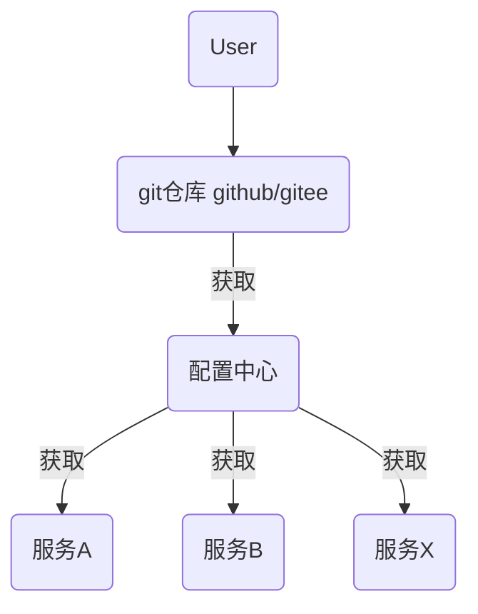

> 配置中心本质上一个微服务，同样需要注册到Eureka注册中心

### 11.2. Git配置管理

#### 11.2.1. 远程Git仓库

+ 创建github远程公开git仓
  + 登录github帐号并创建一个公开仓库
  + 为微服务添加配置文件：{service-name}-{profile}-yml
+ 搭建配置中心微服务 config-service

```xml
<!-- pom -->
<dependencies>
    <dependency>
        <groupId>org.springframework.cloud</groupId>
        <artifactId>spring-cloud-starter-netflix-eureka-client</artifactId>
    </dependency>
    <dependency>
        <groupId>org.springframework.cloud</groupId>
        <artifactId>spring-cloud-config-server</artifactId>
    </dependency>
</dependencies>
```

```java
// 启动器
import org.springframework.boot.SpringApplication;
import org.springframework.boot.autoconfigure.SpringBootApplication;
import org.springframework.cloud.config.server.EnableConfigServer;

@EnableConfigServer
@SpringBootApplication
public class ConfigServerApplication {
  public static void main(String[] args) {
    SpringApplication.run(ConfigServerApplication.class, args);
  }
}
```

```yaml
server:
  port: 10010
spring:
  application:
    name: config-server
  cloud:
    config:
      server:
        git:
          uri: https://github.com/poechiang/macro-service-framework-config.git

eureka:
  client:
    service-url:
    	defaultZone: http://localhost:10086/eureka/

```

> **测试**
>
> 先后启动注册中心服务和配置服务，浏览器访问http://127.0.0.1:10010/user-dev.yml 应该正常显示远程仓库中对应的user-dev.yml中的配置内容

#### 11.2.2. 获取远程配置

将远程仓库中的配置拉取并应用于对应的service

+ 删除user-service中的application.yml （**新版本的spring，不再支持bootstrap，所以不需要删除，后续的配置内容仍在该文件中编写**）

+ 修改配置，从config-service中获取配置内容

  + 添加启动器依赖 user-service

  ```diff
  +  <dependency>
  +      <groupId>org.springframework.cloud</groupId>
  +      <artifactId>spring-cloud-starter-config</artifactId>
  +  </dependency>
  ```

  + 新增配置文件 bootstrap.yml (新版本中仍然使用application.yml) user-service

  ```yaml
  spring:
  	# 最新版本的spring cloud中，config.import为必须，且取值为optional:configserver:
    config:
      import: optional:configserver:file # file部分可以随便写，但不能没有，否则会被ide格式化，造成配置无效
    cloud:
      config:
      	# 仓库中配置文件的application保持一致，如果和spring.application.name一致，可以省略
        name: user
        # 仓库中配置文件的profile保持一致，和spring.confing.profiles.active同，但优先级更高
        profile: dev 
        label: main # 仓库中配置文件所在的分支保持一致
        discovery:
          enabled: true # 开启配置中心        
          service-id: config-server # 配置中心的service-id
  
  eureka:
    client:
      service-url:
        defaultZone: http://localhost:10086/eureka
        # defaultZone: http://localhost:10086/eureka,http://localhost:10087/eureka
  ```

  + 测试

修改完成后，依次启动注册中心，配置服务和用户服务，原访问地址，应能正常返回指定的用户信息

>不论是远程仓库中的配置内容，还是本地分散的配置文件，在具体微服务内，可以通过@Value注解拿到具体配置项的内容
>
>```java
>import org.springframework.beans.factory.annotation.Value;
>
>public class UserController {
>
>  @Value("${spring.application.name}")
>  private String appName;
>	
>  // 自定义配置项
>  @Value("${test.name")
>  private String testName;
>
>}
>```
>
>修改了配置文件的内容后，本地微服务需要重新启动后才能刷新最新的内容

## 12. Spring Bus 总线

### 12.1. 简介

Spring Cloud Bus 用轻量的消息代理连接分布式的节点，用于：

+ 广播配置文件的更改
+ 服务的监控管理
+ 实现应用程序之前相互通信

种类：

+ RabbitMQ
+ Kafka

### 12.2. 应用

+ 启动RabbitMQ
+ 添加依赖并修改配置

配置中心：

```diff
+  <dependency>
+      <groupId>org.springframework.cloud</groupId>
+      <artifactId>spring-cloud-bus</artifactId>
+  </dependency>
+  <dependency>
+      <groupId>org.springframework.cloud</groupId>
+      <artifactId>spring-cloud-stream-binder-rabbit</artifactId>
+      <version>4.1.3</version>
+  </dependency>
```

```diff

+  # 配置rabbit
+  rabbitmq:
+    host: localhost
+    port: 5672
+    username: guest
+    password: guest

+  management:
+    endpoints:
+      web:
+        exposure:
+          # 暴露触发消息总线的地址
+          include: config-refresh

```

服务提供方:

```diff
+  <dependency>
+      <groupId>org.springframework.cloud</groupId>
+      <artifactId>spring-cloud-bus</artifactId>
+  </dependency>
+  <dependency>
+      <groupId>org.springframework.cloud</groupId>
+      <artifactId>spring-cloud-stream-binder-rabbit</artifactId>
+      <version>4.1.3</version>
+  </dependency>
+  <dependency>
+      <groupId>org.springframework.boot</groupId>
+      <artifactId>spring-boot-starter-actuator</artifactId>
+  </dependency>
```

```diff

+  # 配置rabbit
+  rabbitmq:
+    host: localhost
+    port: 5672
+    username: guest
+    password: guest
```

```diff
+  @RefreshScope
  public class UserController {
    @Value("${spring.application.name}")
    private String appName;
    @Value("${test.name")
    private String testName;
  }
```


+ 发送post请求，及时更新配置到本地并升效
+ 测试

## 13. Spring Cloud总结

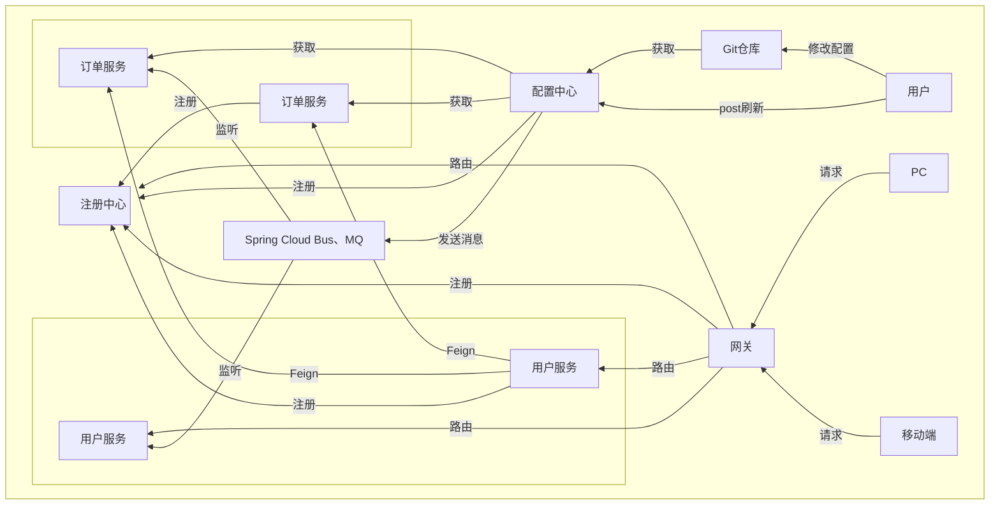

